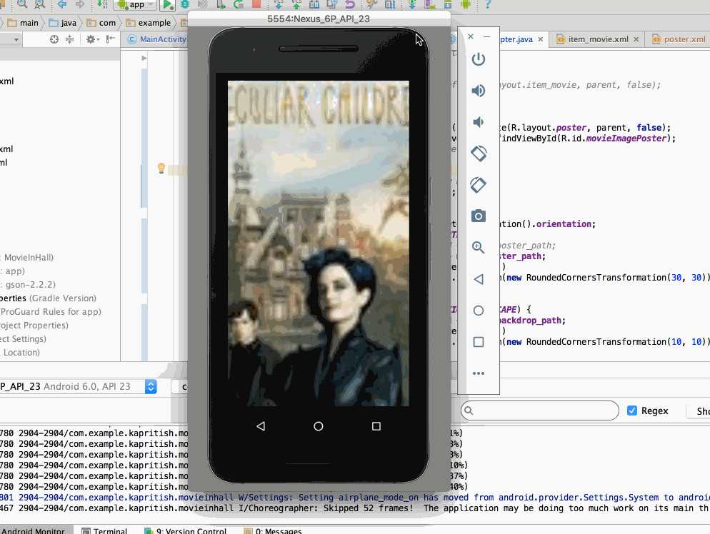

# MovieInHall

It is a read-only movie listing app using the Movie Database API.

Time spent: **7** hours spent in total

## User Stories

The following **required** functionality is completed:

* [x] User can view a list of movies (title, poster image, and overview) currently playing in theaters from the Movie Database API.
* [x] Lists should be fully optimized for performance with the ViewHolder pattern.
* [x] Views should be responsive for both landscape/portrait mode.
  * [x] In portrait mode, the poster image, title, and movie overview is shown
  * [x] In landscape mode, the rotated layout should use the backdrop image instead and show the title and movie overview to the right of it.

The following **optional** features are implemented:

* [ ] Add a pull-to-refresh for the list of movies with SwipeRefreshLayout.
* [ ] Display a nice default placeholder graphic for each image during loading.  
* [ ] Improve the user interface through styling and coloring.
* [ ] For popular movies (i.e. a movie voted for more than 5 stars), the full backdrop image is displayed. Otherwise, a poster image, the movie title, and overview is listed. Use Heterogenous ListViews and use different ViewHolder layout files for popular movies and less popular ones

The following **bonus** features are implemented:

* [ ] Stretch: Add a rounded corners for the images using the Picasso transformations. (1 point)

## Video Walkthrough

Here's a walkthrough of implemented user stories:

## Open-source libraries used

- [Android Async HTTP](https://github.com/loopj/android-async-http) - Simple asynchronous HTTP requests with JSON parsing
- [Picasso](http://square.github.io/picasso/) - Image loading and caching library for Android
